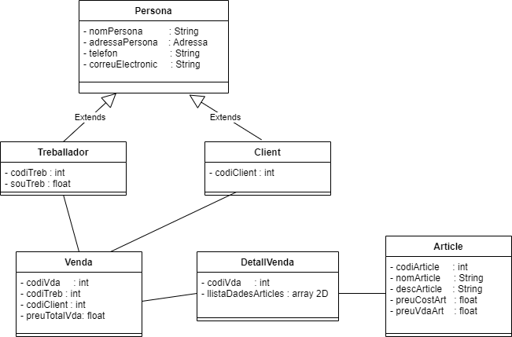

# Botiga d'**Informàtica**

## Blockquotes:
> Dorothy followed her through many of the beautiful rooms in her castle.

## Taula:


| Syntax | ***Description*** | Description |
| :----------- | -----------: | :-----------: |
| **Header** | **Title** | Title |
| *Paragraph* | Text | ~~Title~~ |
| **Header** | **Title** | Title |
| *Paragraph* | Text | ~~Title~~ |
| **Header** | **Title** | Title |
| *Paragraph* | Text | ~~Title~~ |
| **Header** | **Title** | Title |
| *Paragraph* | Text | ~~Title~~ |

<hr>
<br>

## Mínims:

1. els *noms* i **cognoms** dels dos ***alumnes*** que hi participen en el ~~repositori~~,
1. text en format títol de diferents nivells, així com

    1. asdfasdf

    1. asdfasdf

    1. asdfasdf
1. text en format Java,
1. text en format SQL,
1. com a mínim una imatge, que serà el diagrama UML que hàgiu dissenyat.

**To Do List**

- [ ] text en format Java,

- [x] text en format SQL,

## Alumnes:

* **Joan Pardo**

## Diagrama UML:



[ginebro.cat](ginebro.cat)


## Codi de java per crear la classe ***```Adressa```***.


<details>
 <summary>Desplega!</summary>

    ```java
        package java;

        public class Adressa {
            private String carrer;
            private String poblacio;
            private String codiPostal;
            private String pais;
            
            public Adressa(String carrer, String poblacio, String codiPostal, String pais) {
                this.carrer = carrer;
                this.poblacio = poblacio;
                this.codiPostal = codiPostal;
                this.pais = pais;
            }

            public String getCarrer() {
                return carrer;
            }

            public void setCarrer(String carrer) {
                this.carrer = carrer;
            }

            public String getPoblacio() {
                return poblacio;
            }

            public void setPoblacio(String poblacio) {
                this.poblacio = poblacio;
            }

            public String getCodiPostal() {
                return codiPostal;
            }

            public void setCodiPostal(String codiPostal) {
                this.codiPostal = codiPostal;
            }

            public String getPais() {
                return pais;
            }

            public void setPais(String pais) {
                this.pais = pais;
            }

            @Override
            public String toString() {
                return "Adressa\n" + 
                        "   carrer     = " + this.carrer + "\n" +
                        "   codiPostal = " + this.codiPostal + "\n" + 
                        "   pais       = " + this.pais + "\n" + 
                        "   poblacio   = " + this.poblacio + "\n";
            }
        }
        ```
</details>

<hr>

## **Taula** amb **```HTML```**:

<table style="font-family: Tahoma;
  border-collapse: collapse;">
  <tr>
    <th>Company</th>
    <th>Contact</th>
    <th>Country</th>
  </tr>
  <tr>
    <td>Alfreds Futterkiste</td>
    <td>Maria Anders</td>
    <td>Germany</td>
  </tr>
  <tr style="background-color: #dddddd;">
    <td>Centro comercial Moctezuma</td>
    <td>Francisco Chang</td>
    <td>Mexico</td>
  </tr>
  <tr>
    <td>Ernst Handel</td>
    <td>Roland Mendel</td>
    <td>Austria</td>
  </tr>
  <tr style="background-color: #dddddd;">
    <td>Island Trading</td>
    <td>Helen Bennett</td>
    <td>UK</td>
  </tr>
  <tr>
    <td>Laughing Bacchus Winecellars</td>
    <td>Yoshi Tannamuri</td>
    <td>Canada</td>
  </tr>
  <tr style="background-color: #dddddd;">
    <td>Magazzini Alimentari Riuniti</td>
    <td>Giovanni Rovelli</td>
    <td>Italy</td>
  </tr>
</table>


```html
<table style="font-family: Tahoma;
  border-collapse: collapse;">
  <tr>
    <th>Company</th>
    <th>Contact</th>
    <th>Country</th>
  </tr>
  <tr>
    <td>Alfreds Futterkiste</td>
    <td>Maria Anders</td>
    <td>Germany</td>
  </tr>
  <tr style="background-color: #dddddd;">
    <td>Centro comercial Moctezuma</td>
    <td>Francisco Chang</td>
    <td>Mexico</td>
  </tr>
  <tr>
    <td>Ernst Handel</td>
    <td>Roland Mendel</td>
    <td>Austria</td>
  </tr>
  <tr style="background-color: #dddddd;">
    <td>Island Trading</td>
    <td>Helen Bennett</td>
    <td>UK</td>
  </tr>
  <tr>
    <td>Laughing Bacchus Winecellars</td>
    <td>Yoshi Tannamuri</td>
    <td>Canada</td>
  </tr>
  <tr style="background-color: #dddddd;">
    <td>Magazzini Alimentari Riuniti</td>
    <td>Giovanni Rovelli</td>
    <td>Italy</td>
  </tr>
</table>
```
```sql

CREATE TABLE CLIENTS (
codi_client     smallint unsigned NOT NULL AUTO_INCREMENT, 
nom_client      varchar(50) NOT NULL, 
adressa_client  varchar(200) NOT NULL, 
telefon_client  varchar(9) NOT NULL, 
correu_client  varchar(30) NOT NULL, 
    PRIMARY KEY (codi_client)
);


```
