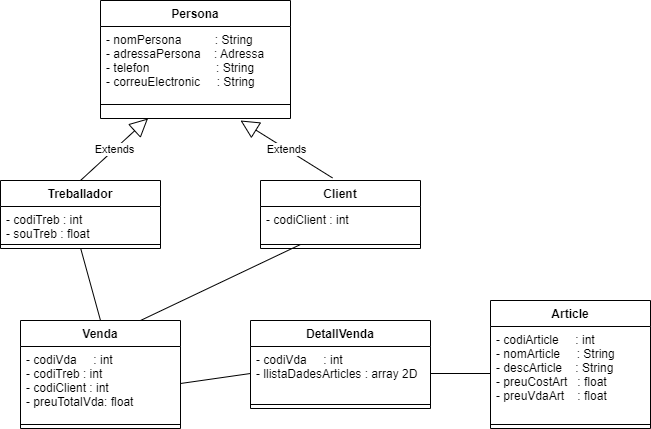

# Botiga d'Informàtica

## Alumnes:

* **Joan Pardo**

## Diagrama UML:



## Codi de java per crear la classe ```Adressa```.

```java
public class Adressa {
    private String carrer;
    private String poblacio;
    private String codiPostal;
    private String pais;
```

